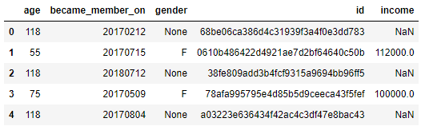
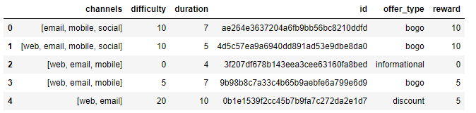
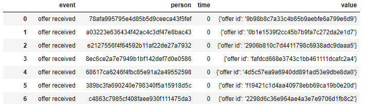
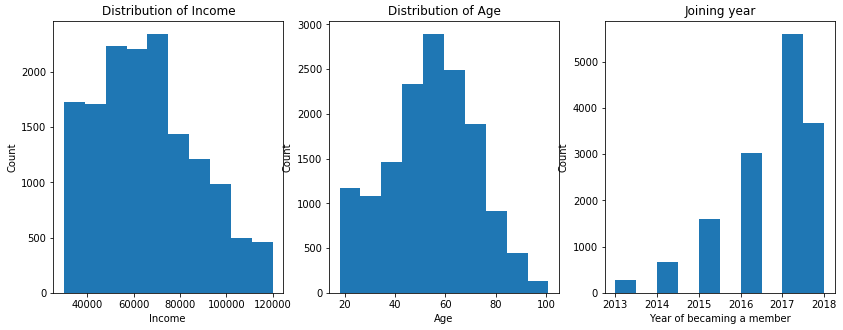
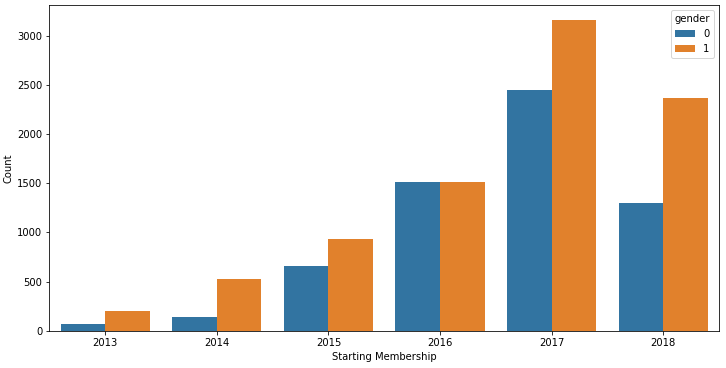

# Starbucks-Capstone-Project

## Introdction

This is the capstone project of udacity data scientist nanodegree. In this project, the dataset of Starbucks customer behavior is investigated and analysed. Starbucks collects data about customers and how they react with the offers sent via mobile app. The offers might be a discount or buy one get one free (BOGO).

## datasets
The data is contained in three files:  
profile.json - demographic data for each customer  
portfolio.json - containing offer ids and meta data about each offer (duration, type, etc.)  
transcript.json - records for transactions, offers received, offers viewed, and offers completed  

1- profile dataset

 
2-portfolio dataset

 
3-transcript dataset

## Data Analysis
After analysing the data of registered customers, we found that most of customers have income in the range (60,000 and 80,000) and in the age of 50s. In addition, the majority of customers joined to app in 2017 and 2018. The distributions of income, age, and joining are presented in the following diagram:

## Building a Model
I built a rendomforest classifier to classify an offer wether it will sucsses with a specific customer or not. The model was trained and tested on 66501 instances (80% of the data used for training and 20% of the data used for testing). The model was evaluated in different matrices as followig:

Accuracy of the model on training data:  0.999962406015   
Accuracy of the model on testing data:  0.916773174949

 
F1 score on training data:  0.999960197421    
F1 score on testing data:  0.912538516236

### Requirements
Python 3.8  
numpy 1.16.4  
pandas 0.22.0  
matplotlib 2.1.2  
## Conclusion
